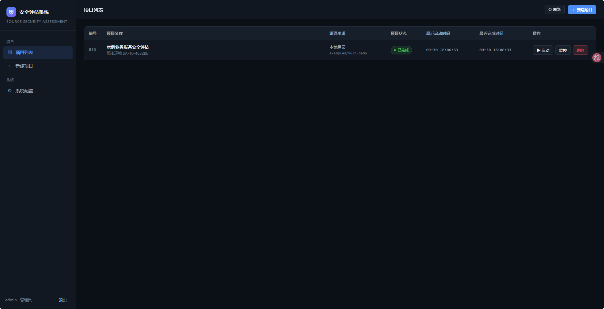
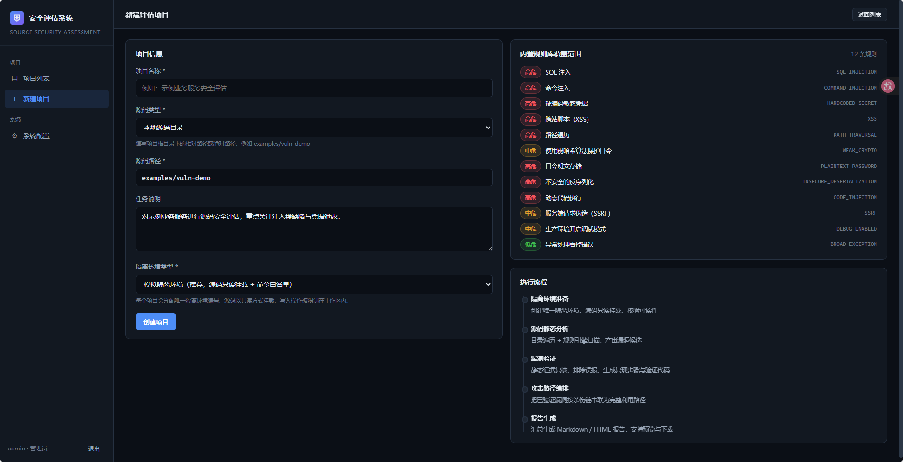
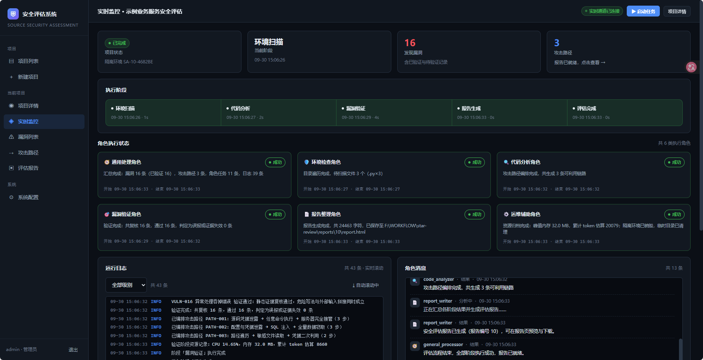
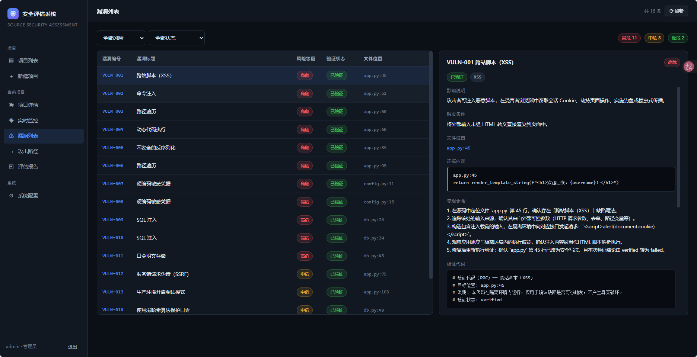
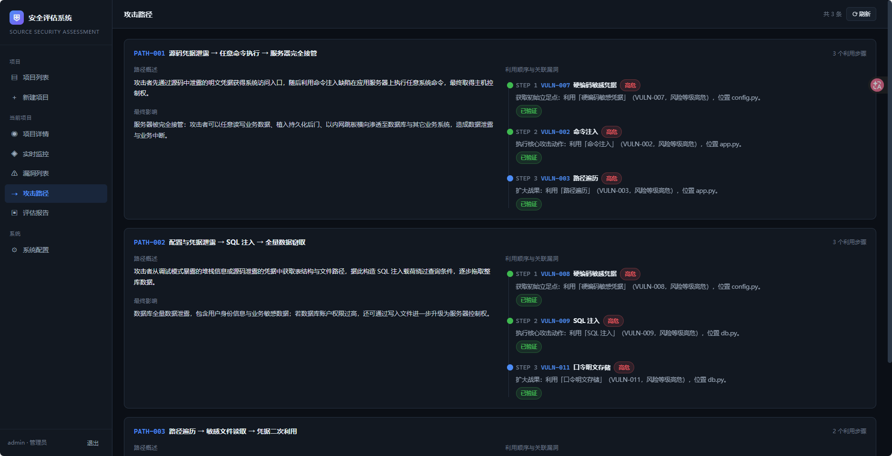
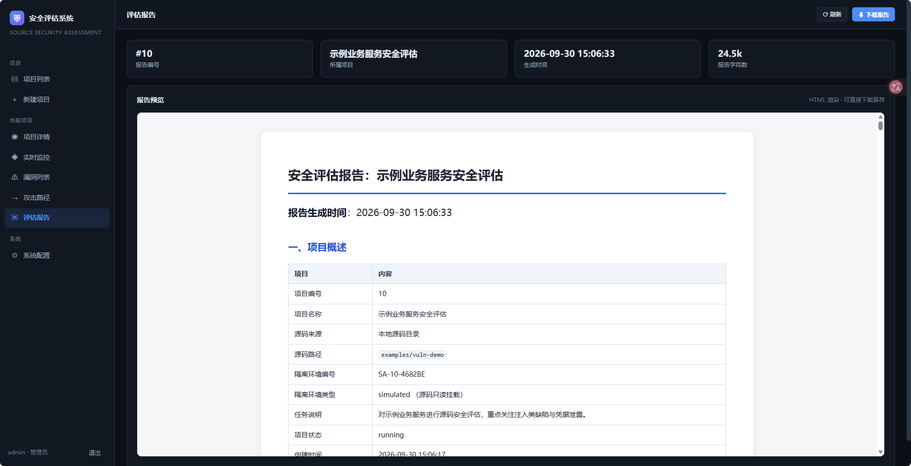
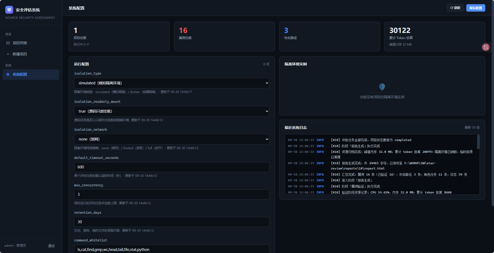

# 自动化安全评估系统

面向源码项目的自动化安全评估系统：**项目接入 → 隔离分析 → 漏洞发现 → 漏洞验证 → 攻击路径整理 → 报告输出**。

系统以只读方式把目标源码挂载进独立隔离环境，由 6 类执行角色分阶段完成静态分析、
证据复核与报告生成，全过程通过 WebSocket 实时推送状态、日志、角色消息与资源消耗。

---

## 界面预览

| 界面 | 截图 |
| --- | --- |
| 项目列表 |  |
| 新建项目 |  |
| 实时监控 |  |
| 漏洞列表 |  |
| 攻击路径 |  |
| 评估报告 |  |
| 系统配置 |  |

---

## 一、快速开始

### 环境要求

| 依赖 | 版本 | 说明 |
| --- | --- | --- |
| Python | ≥ 3.12 | 后端运行环境 |
| Node.js | ≥ 18 | 仅构建前端时需要 |
| 操作系统 | Windows / Linux / macOS | 隔离环境为模拟实现，无需 Docker |

### 启动方式

**方式一：一键脚本（推荐）**

```bat
:: Windows
start.bat
```

```bash
# Linux / macOS / Git Bash
./start.sh
```

脚本会自动完成：安装后端依赖 → 构建前端（首次）→ 启动服务。

**方式二：手动启动**

```bash
# 1) 安装后端依赖
uv pip install --python .venv/Scripts/python.exe -e .

# 2) 构建前端（首次或前端代码有改动时）
cd frontend && npm install && npm run build && cd ..

# 3) 启动服务
.venv/Scripts/python.exe -m app.main
```

启动后访问：

| 地址 | 说明 |
| --- | --- |
| http://127.0.0.1:8002 | 前端界面 |
| http://127.0.0.1:8002/api/docs | Swagger 接口文档 |
| http://127.0.0.1:8002/api/openapi.json | OpenAPI 描述文件 |

### 首次使用

1. 打开 http://127.0.0.1:8002 ，进入登录页。
2. 点击 **「初始化系统」** 创建管理员账户（默认 `admin` / `admin123`）。
3. 使用该账户登录，进入项目列表页。

### 前端开发模式

需要热更新调试前端时，可让 Vite 开发服务器代理到后端：

```bash
cd frontend && npm run dev     # http://127.0.0.1:5173，/api 与 WebSocket 自动代理到 8002
```

---

## 二、完整演示链路

### 方式一：浏览器手动演示

1. **登录** —— 打开 http://127.0.0.1:8002/#/login ，使用 `admin` / `admin123` 登录。
2. **创建项目** —— 点击「新建项目」，填写：
   - 项目名称：`示例业务服务安全评估`
   - 源码类型：`本地源码目录`
   - 源码路径：`examples/vuln-demo`
   - 任务说明：`对示例业务服务进行源码安全评估，重点关注注入类缺陷与凭据泄露`
3. **启动任务** —— 在项目详情页点击「启动任务」，自动跳转到实时监控页。
4. **观察执行** —— 在实时监控页可以看到：
   - 五个阶段依次推进（环境扫描 → 代码分析 → 漏洞验证 → 报告生成 → 评估完成）
   - 6 类角色卡片的执行状态实时变化
   - 日志滚动、角色消息陆续输出、CPU / 内存 / Token 曲线实时绘制
   - 漏洞发现事件实时推送
5. **查看结果** —— 依次打开：
   - **漏洞列表页**：16 条漏洞，可按风险等级与验证状态筛选，点击查看影响说明、
     触发条件、证据内容、复现步骤与验证代码
   - **攻击路径页**：3 条完整利用链，含关联漏洞、利用顺序与最终影响
   - **报告页**：完整评估报告预览，支持下载 HTML 文件
6. **停止与删除** —— 在项目列表中可随时停止执行中的任务；
   删除项目会同时清理关联记录与日志、报告、临时目录。

### 方式二：无头演示脚本

```bash
# 完整链路演示（先启动后端服务）
.venv/Scripts/python.exe demo/run_demo.py

# 演示「停止任务」：中途停止并确认已保存数据保留
.venv/Scripts/python.exe demo/run_demo.py --demo-stop

# 演示结束后保留项目，便于在浏览器中继续查看
.venv/Scripts/python.exe demo/run_demo.py --keep
```

### 方式三：验收自检

逐项核对需求文档的可验证条目（接口、消息类型、输出格式、文件存储、停止与删除）：

```bash
.venv/Scripts/python.exe demo/verify.py
```

预期输出：`通过 54 / 54 —— 全部验收项通过`。

### 方式四：前端界面自动化检查（可选）

用 Playwright 驱动本机已安装的浏览器逐页访问，确认 9 个页面均可渲染、
实时监控页能收到推送、控制台无报错，并把截图存到 `demo/screenshots/`：

```bash
# 复用本机已安装的 Edge，无需下载浏览器
uv pip install playwright
.venv/Scripts/python.exe demo/ui_check.py

# 使用 Chrome，或显示浏览器窗口
.venv/Scripts/python.exe demo/ui_check.py --channel chrome --headed
```

预期输出：`通过 59 / 59 —— 全部界面检查项通过`。

---

## 三、目录结构

```
star-review/
├── app/                        后端应用
│   ├── main.py                 FastAPI 入口、静态托管、生命周期
│   ├── config.py               目录布局、系统配置读写
│   ├── db.py                   SQLite 数据访问层
│   ├── security.py             pbkdf2 口令哈希、令牌与隔离环境编号生成
│   ├── auth.py                 登录态识别依赖
│   ├── schemas.py              请求数据模型
│   ├── ws.py                   WebSocket 广播中心
│   ├── routers/
│   │   ├── system.py           认证模块 + 系统配置模块
│   │   ├── projects.py         项目模块
│   │   └── results.py          结果查询 + 实时流
│   └── engine/                 评估引擎
│       ├── sandbox.py          隔离环境模块（5 种执行能力）
│       ├── scheduler.py        调度模块（阶段推进、角色分发、状态汇总）
│       ├── rules.py            规则引擎（12 条缺陷模式）
│       ├── analyzer.py         代码分析
│       ├── verifier.py         漏洞验证与误报判定
│       ├── path_builder.py     攻击路径编排
│       ├── reporter.py         报告生成（Markdown + HTML）
│       └── metrics.py          资源消耗采样
├── frontend/                   React + Vite 前端
│   └── src/
│       ├── pages/              9 个页面
│       ├── components/         布局、步进器、角色卡片、日志/消息/资源面板
│       ├── api.js              接口封装
│       ├── ws.js               WebSocket 订阅（自动重连 + 心跳）
│       └── constants.js        状态枚举与中文标签
├── scripts/init_db.sql         数据库初始化脚本（幂等，可重复执行）
├── examples/vuln-demo/         示例评估目标项目（含 12 类故意植入的缺陷）
├── demo/
│   ├── run_demo.py             端到端演示脚本
│   ├── verify.py               验收自检脚本（接口 / 消息 / 存储 / 删除）
│   ├── ui_check.py             前端界面自动化检查（可选，需 Playwright）
│   └── screenshots/            界面检查截图输出
├── runtime_logs/{project_id}/  运行日志文件
├── reports/{project_id}/       报告文件（report.md / report.html）
├── workspace/{project_id}/     临时执行目录
├── data/star_review.db         SQLite 数据库
├── start.bat / start.sh        一键启动脚本
└── pyproject.toml
```

---

## 四、接口说明

所有接口以 `/api` 为前缀。除初始化与登录外，均需在请求头携带登录令牌：

```
Authorization: Bearer <token>
```

WebSocket 因浏览器限制无法自定义请求头，令牌通过查询参数传递：`?token=<token>`。

### 4.1 系统与认证

| 方法 | 路径 | 说明 |
| --- | --- | --- |
| POST | `/api/system/init` | 初始化管理员账户（幂等，不覆盖已有密码） |
| POST | `/api/system/login` | 登录，请求字段 `username`、`password` |
| POST | `/api/system/logout` | 退出登录 |
| GET | `/api/system/me` | 当前登录用户信息 |
| GET | `/api/system/config` | 查询系统配置 |
| PUT | `/api/system/config` | 更新系统配置（需管理员） |
| GET | `/api/system/overview` | 系统总览：资源消耗与运行统计 |
| GET | `/api/health` | 健康检查 |
| GET | `/api/rules` | 内置规则库清单 |

**POST /api/system/init**

```json
// 请求
{ "username": "admin", "password": "admin123" }

// 响应
{ "initialized": true, "message": "系统初始化完成，管理员账户已创建",
  "user_id": 1, "username": "admin" }
```

**POST /api/system/login**

```json
// 响应
{ "token": "…", "username": "admin", "role": "admin", "expires_in": 86400 }
```

### 4.2 项目管理

| 方法 | 路径 | 说明 |
| --- | --- | --- |
| POST | `/api/projects` | 创建项目 |
| GET | `/api/projects` | 查询项目列表（支持 `project_status` 筛选） |
| GET | `/api/projects/{project_id}` | 查询项目详情（含漏洞数、路径数、报告状态） |
| POST | `/api/projects/{project_id}/start` | 启动评估任务 |
| POST | `/api/projects/{project_id}/stop` | 停止评估任务 |
| DELETE | `/api/projects/{project_id}` | 删除项目及其全部关联数据与文件目录 |
| GET | `/api/projects/{project_id}/sandbox` | 查询项目隔离环境信息 |

**POST /api/projects**

```json
// 请求
{
  "project_name": "示例业务服务安全评估",
  "source_type": "local",              // local | git
  "source_path": "examples/vuln-demo",
  "task_content": "重点关注注入类缺陷",
  "isolation_type": "simulated"        // simulated | docker
}
```

**POST /api/projects/{project_id}/stop** —— 停止后当前阶段不再继续执行，
已保存的漏洞、阶段、角色任务与日志记录全部保留。

**DELETE /api/projects/{project_id}** —— 同时删除关联的漏洞记录、攻击路径记录、
聊天消息、日志、资源记录与隔离环境记录，并清理 `runtime_logs/`、`reports/`、
`workspace/` 下对应的项目目录。

### 4.3 结果查询

| 方法 | 路径 | 说明 |
| --- | --- | --- |
| GET | `/api/projects/{project_id}/stages` | 查询阶段状态 |
| GET | `/api/projects/{project_id}/workers` | 查询角色执行状态（支持 `stage_id` 筛选） |
| GET | `/api/projects/{project_id}/roles` | 六类角色的当前状态汇总 |
| GET | `/api/projects/{project_id}/vulnerabilities` | 查询漏洞列表（支持 `risk_level`、`verify_status` 筛选） |
| GET | `/api/projects/{project_id}/vulnerabilities/{vuln_id}` | 查询漏洞详情 |
| GET | `/api/projects/{project_id}/attack-paths` | 查询攻击路径列表 |
| GET | `/api/projects/{project_id}/report` | 查询最终报告 |
| GET | `/api/projects/{project_id}/report/download` | 下载报告 HTML 文件 |
| GET | `/api/projects/{project_id}/logs` | 查询运行日志（支持 `log_level`、`limit`、`since_id`） |
| GET | `/api/projects/{project_id}/resources` | 查询资源消耗 |
| GET | `/api/projects/{project_id}/messages` | 查询角色聊天消息 |
| GET | `/api/projects/{project_id}/snapshot` | 监控页首屏数据快照 |

### 4.4 实时订阅

```
WS /api/projects/{project_id}/stream?token=<登录令牌>
```

连接建立后先收到一条 `connected` 消息，随后按下表推送。客户端需周期性发送任意文本
作为心跳（前端每 25 秒发送一次 `ping`）。鉴权失败时服务端以关闭码 `4401` 关闭连接，
项目不存在时以 `4404` 关闭。

消息统一包裹为 `{"type": <类型>, "data": {...}, "ts": <时间>}`：

| type | data 最低字段 |
| --- | --- |
| `project_status` | `project_id`、`project_status` |
| `stage_status` | `project_id`、`stage_name`、`stage_status` |
| `worker_status` | `worker_task_id`、`worker_role`、`task_status` |
| `chat_message` | `worker_role`、`message_text` |
| `runtime_log` | `log_level`、`log_content` |
| `resource_usage` | `cpu_usage`、`memory_usage`、`token_count` |
| `vulnerability_found` | `vuln_id`、`vuln_title`、`risk_level` |
| `report_ready` | `project_id`、`report_id` |

---

## 五、状态与阶段定义

**项目状态**（`projects.project_status`）

`created` 已创建 · `running` 执行中 · `completed` 已完成 · `failed` 失败 · `stopped` 已停止

**执行阶段**（`runtime_stages.stage_name`）

```
environment_scan → code_analysis → vulnerability_verify → report_generate → done
```

**阶段 / 角色任务状态**（`stage_status` / `task_status`）

`idle` 待执行 · `running` 执行中 · `success` 成功 · `failed` 失败 · `stopped` 已停止

**漏洞验证状态**（`vulnerabilities.verify_status`）

`unverified` 待验证 · `verified` 已验证 · `failed` 未通过验证

**风险等级**（`vulnerabilities.risk_level`）

`high` 高危 · `medium` 中危 · `low` 低危

---

## 六、执行角色分工

任务启动后必须**先准备隔离环境**，再进入阶段执行。每个阶段由若干角色承担，
每个角色单独落一条 `worker_tasks` 记录（任务内容、开始/结束时间、执行结果、错误信息），
并可通过 `project_id` + `stage_id` 回溯到所属项目与阶段。

| 角色 | 标识 | 承担工作 |
| --- | --- | --- |
| 通用处理角色 | `general_processor` | 任务登记、阶段产出汇总、结果交接 |
| 环境检查角色 | `env_checker` | 创建隔离环境、校验只读挂载、目录遍历、文件清单 |
| 代码分析角色 | `code_analyzer` | 规则引擎扫描、攻击路径编排 |
| 漏洞验证角色 | `vuln_verifier` | 静态证据复核、误报判定、生成复现步骤与验证代码 |
| 报告整理角色 | `report_writer` | 汇总各阶段结果、生成最终报告 |
| 运维辅助角色 | `ops_helper` | 资源消耗采样、日志目录维护、环境销毁与临时文件清理 |

| 阶段 | 参与角色 |
| --- | --- |
| `environment_scan` | env_checker、ops_helper、general_processor |
| `code_analysis` | env_checker、code_analyzer、ops_helper、general_processor |
| `vulnerability_verify` | vuln_verifier、code_analyzer、ops_helper |
| `report_generate` | general_processor、report_writer、ops_helper |

---

## 七、隔离环境与安全设计

### 隔离环境

每个项目分配唯一隔离环境编号 `SA-{project_id}-{随机串}`，记录在 `sandboxes` 表。

本系统默认使用**模拟隔离环境**（`isolation_type=simulated`），不依赖 Docker：

- **只读挂载**：源码目录以只读方式接入，引擎仅通过只读句柄读取源码；
  一切写入被重定向到 `workspace/{project_id}/`。
- **命令白名单**：隔离环境内的命令执行必须命中 `system_configs.command_whitelist`
  （默认 `ls,cat,find,grep,wc,head,tail,file,stat,python`）。
- **不经过 shell**：命令以参数数组形式调用（`shell=False`），从根本上杜绝
  `;`、`|`、`&&` 等注入手法。
- **路径围栏**：命令的工作目录限定在 `workspace/{project_id}/` 内；
  参数中的绝对路径必须落在源码根或工作区内，越界直接阻断。
- **路径穿越防护**：源码读取接口对解析后的路径做归属校验，阻断 `../` 逃逸。

### 评估过程不产生真实破坏

漏洞"验证"阶段做的是**静态证据复核**，不执行示例项目中的危险调用：

1. 重读命中位置，确认危险写法在当前代码中依然成立 —— 否则判定为「证据失效」；
2. 检查命中位置附近是否存在净化 / 参数化写法 —— 命中则判定为「误报」；
3. 通过复核的漏洞标记为 `verified`，并生成复现步骤与**验证代码**。
   验证代码中的危险调用为**还原式拼接**（只拼接字符串，不执行），
   仅用于直观展示载荷如何改变语义。

因此 `examples/vuln-demo` 中的 `os.system`、`eval`、`pickle.loads` 等写法
不会被真正执行。

### 规则引擎

12 条规则，每条由「触发模式 + 污点模式」双条件判定，降低纯关键字匹配的误报率。
匹配在「当前行 + 后 2 行」的滑动窗口上进行，以覆盖跨行调用。

| 规则标识 | 缺陷类型 | 风险 |
| --- | --- | --- |
| `SQL_INJECTION` | SQL 注入 | 高危 |
| `COMMAND_INJECTION` | 命令注入 | 高危 |
| `CODE_INJECTION` | 动态代码执行 | 高危 |
| `INSECURE_DESERIALIZATION` | 不安全的反序列化 | 高危 |
| `XSS` | 跨站脚本 | 高危 |
| `PATH_TRAVERSAL` | 路径遍历 | 高危 |
| `HARDCODED_SECRET` | 硬编码敏感凭据 | 高危 |
| `PLAINTEXT_PASSWORD` | 口令明文存储 | 高危 |
| `WEAK_CRYPTO` | 使用弱哈希算法保护口令 | 中危 |
| `SSRF` | 服务端请求伪造 | 中危 |
| `DEBUG_ENABLED` | 生产环境开启调试模式 | 中危 |
| `BROAD_EXCEPTION` | 异常处理吞掉错误 | 低危 |

---

## 八、数据库

数据库为 SQLite，文件位于 `data/star_review.db`，初始化脚本为 `scripts/init_db.sql`
（全部使用 `CREATE TABLE IF NOT EXISTS`，幂等可重复执行）。服务启动时自动执行。

核心数据表：

| 表 | 说明 |
| --- | --- |
| `users` | 用户账户 |
| `projects` | 评估项目 |
| `runtime_stages` | 阶段执行记录 |
| `worker_tasks` | 角色任务记录 |
| `vulnerabilities` | 漏洞记录 |
| `attack_paths` / `attack_path_items` | 攻击路径与步骤（关联漏洞） |
| `chat_messages` | 角色聊天消息 |
| `runtime_logs` | 运行日志 |
| `resource_usages` | 资源消耗 |
| `reports` | 评估报告 |

支撑表：`sessions`（登录态）、`system_configs`（系统配置）、`sandboxes`（隔离环境）。

> 说明：`worker_tasks` 额外包含 `error_message`（需求要求保存错误信息），
> `vulnerabilities` 额外包含 `impact_text`、`remediation_text`、`rule_key`、
> `line_no`、`category`（用于漏洞详情展示与攻击路径编排）。
> 这些字段是在需求规定字段之外**追加**的，不影响规定字段的含义与位置。

---

## 九、系统配置项

在「系统配置页」查看与修改（修改需管理员权限）：

| 配置项 | 默认值 | 说明 |
| --- | --- | --- |
| `isolation_type` | `simulated` | 隔离环境类型 |
| `isolation_readonly_mount` | `true` | 源码是否只读挂载 |
| `isolation_network` | `none` | 隔离环境网络策略 |
| `default_timeout_seconds` | `600` | 单个任务默认超时时间 |
| `max_concurrency` | `3` | 同时运行的评估任务并发上限 |
| `retention_days` | `30` | 日志、报告、临时文件保留天数 |
| `command_whitelist` | `ls,cat,find,grep,wc,head,tail,file,stat,python` | 隔离环境允许执行的命令 |
| `max_scan_files` | `2000` | 单次代码分析最多扫描的文件数 |

---

## 十、常见问题

**Q：登录页提示「用户名或密码错误」？**
A：首次使用需先点击登录页的「初始化系统」按钮创建管理员账户。
若数据库已存在管理员但忘记密码，可删除 `data/star_review.db` 后重新初始化
（会同时清空所有项目数据）。

**Q：创建项目时提示「源码路径不存在」？**
A：本地源码路径支持相对路径（相对项目根目录）与绝对路径。
默认示例路径为 `examples/vuln-demo`，请确认该目录存在。

**Q：任务一直停在某个阶段？**
A：检查是否触发了并发上限（默认 3 个任务同时运行）。
可在系统配置页调大 `max_concurrency`。任务超时上限由
`default_timeout_seconds` 控制，超时后任务会自动停止。

**Q：实时监控页显示「重连中」？**
A：WebSocket 断线后会自动重连（间隔 2 秒起，最多 15 秒）。
若显示「登录态失效」，请重新登录。

**Q：如何重置全部数据？**
A：停止服务，删除 `data/` 目录以及 `runtime_logs/`、`reports/`、`workspace/`
下的项目子目录，重新启动服务即可。
